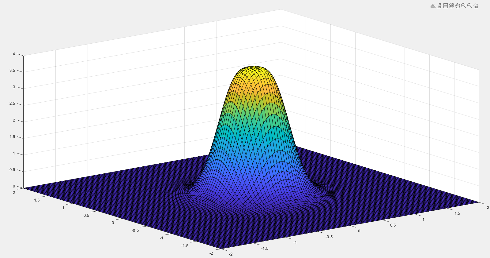
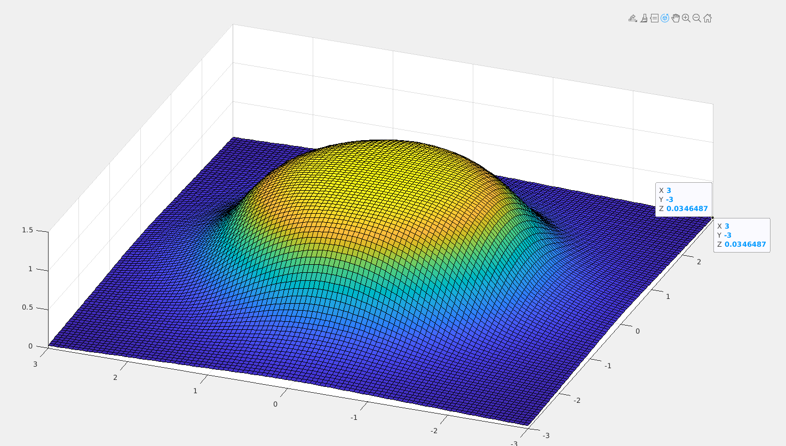
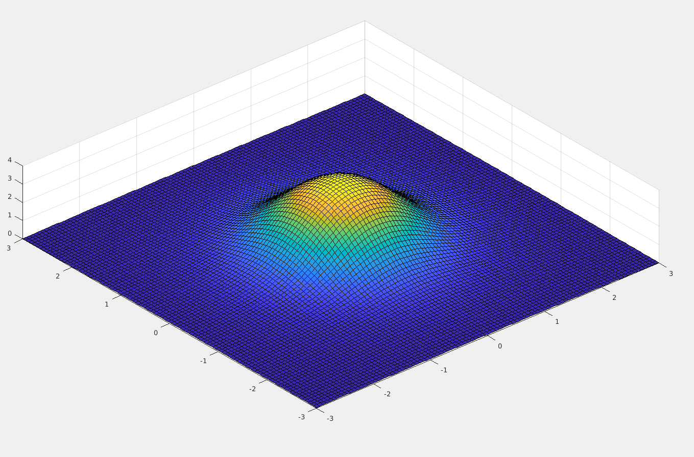

# Desenvolvimento de Anel de Leds para Rastreamento de Objetos

### Parâmetros para escolha de um anel de LED

[Configurable and Powerful Ring Lights for machine vision](https://www.effilux.com/en/products/ring/effi-ring#optical)

### Diferença entre LED’s de 850 e 940nm

[850nm vs 940nm. Which infrared wavelength is better?](https://nightfoxstore.com/blogs/news/850nm-vs-940nm-which-infrared-wavelength-is-better)

[850nm vs. 940nm Infra-Red Lighting - Raytec](https://www.raytecled.com/850nm-vs-940nm-infra-red-lighting/)

## Uniformidade na Iluminação

### Simulação

- **Anel de Led**

- Dados
   
    Distância(z) = 1m
   
    N. Leds = 10
   
    Angle view = 30
   
- Arena 4 Anéis de LED’s
   
    
   

A imagem acima é correspondente a iluminação da arena provida pelos 4 anéis de LED quando estes estão com o raio de melhor distribuição (r = 1.1971)

A imagem acima é correspondente a iluminação da arena provida pelos 4 anéis de LED quando estes estão com o raio atual (r = 0.03)

## Espectometro

- Uso de dois espectrômetros (ASEQ - OCEAN)
    - Experimentos de varredura de frequência
       
        Sem filtro
       
        Com filtro de 850nm - próximo a fonte
       
        Com filtro de 850nm - próximo ao sensor
       
   
    
   
- É perceptível que a faixa de operação do Led  é estreita quando mesmo quando usada sem filtro.
- Já com o filtro a faixa fica ainda mais estreita (Pode ser aproximado por um impulso!)

## Inclusão do  ngulo Beta

Os led não precisam estar necessariamente a 90 graus do plano do anel, eles podem apresentar ângulos maiores ou menores a depender da necessidade.

-  ngulos maiores aumentam o raio final do anel no plano de atuação, em contrapartida diminui a concentração de luminosidade no centro.
-  ngulos menores diminuem o raio final do anel no plano de atuação, intensificando assim a luminosidade no centro.

- Na imagem acima o ângulo de atuação foi aumentado fazendo com que a distribuição fosse mais uniforme, mesmo com um raio do anel pequeno.
- Para tal foram criados planos de atuação para cada um dos leds, neste exemplo o anel era composto apenas por quatro leds.

### Fornecedores e Datasheets

