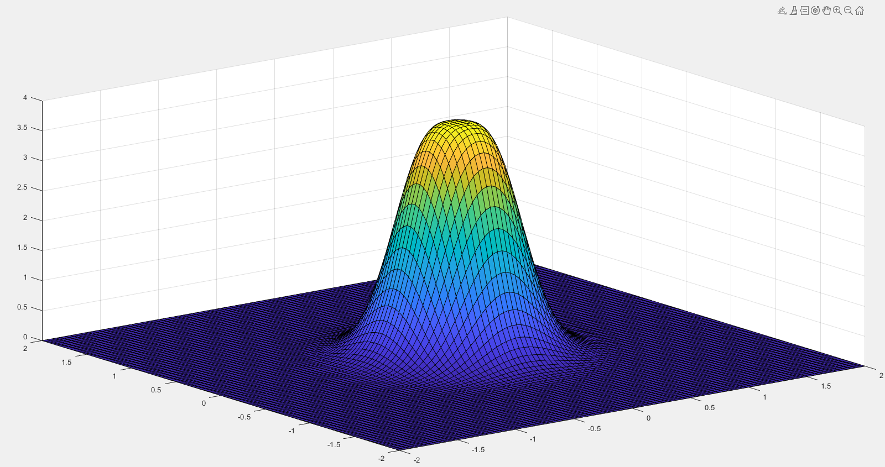
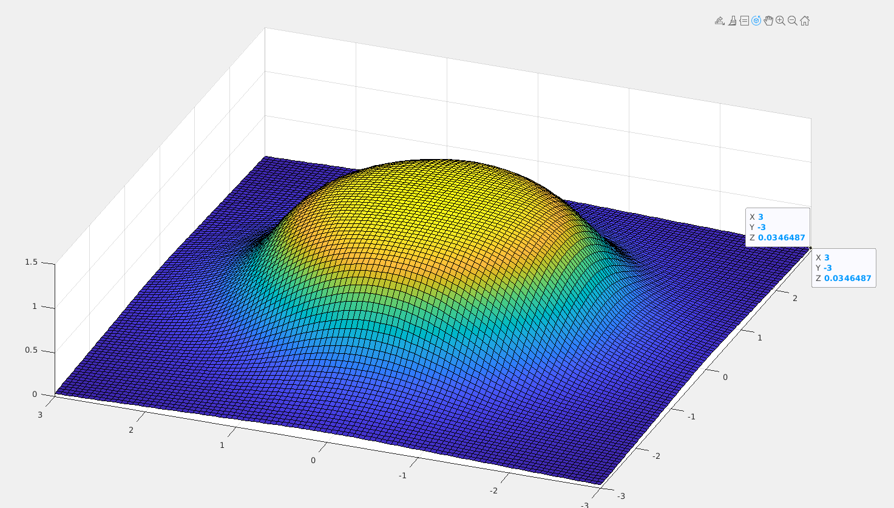
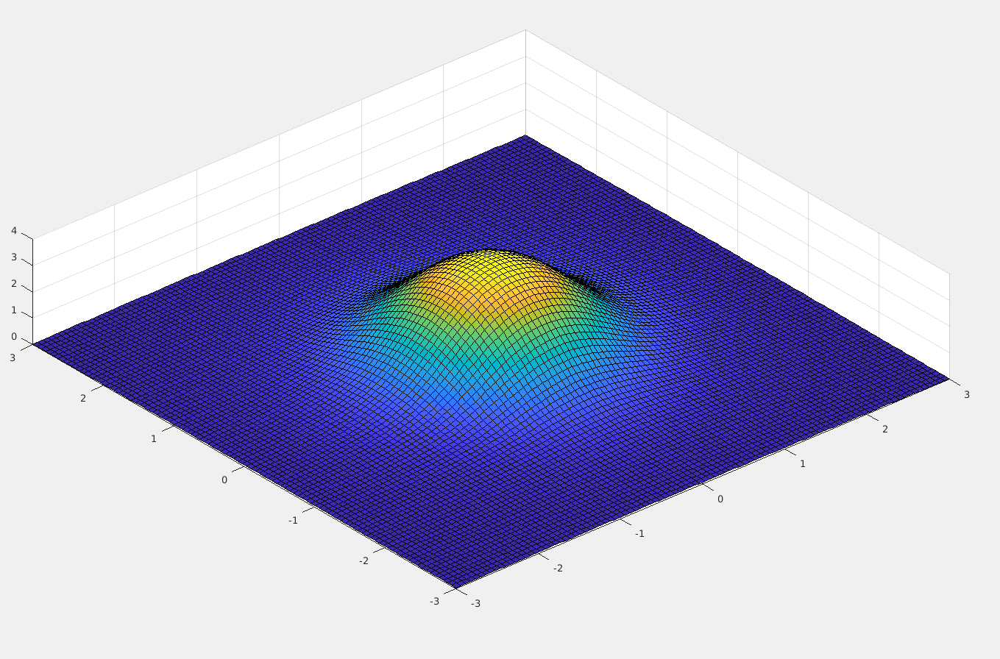
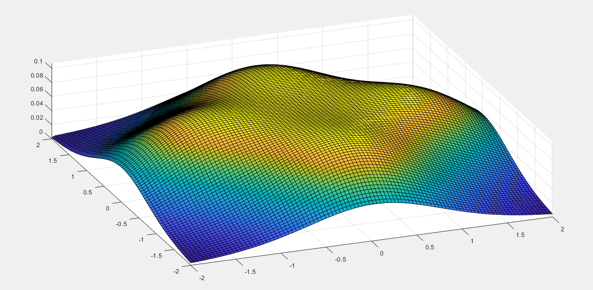
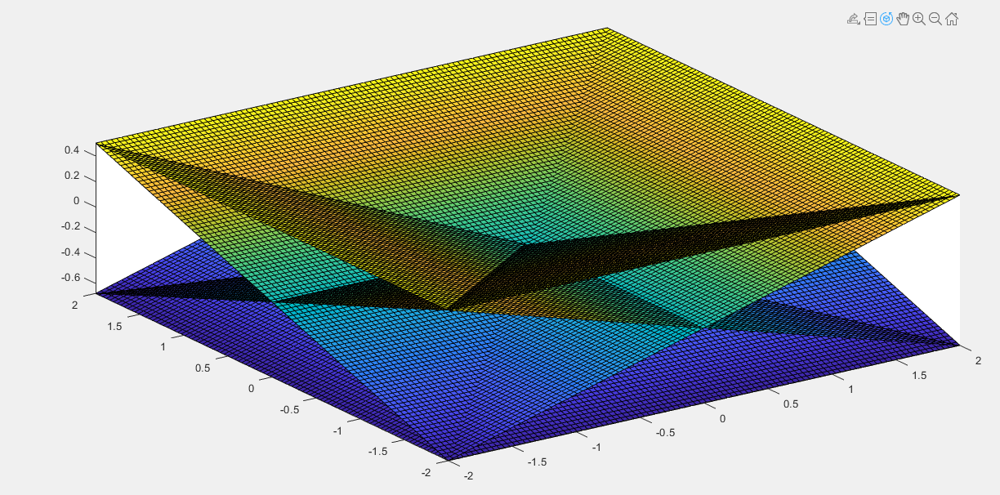

# Simulation

- The simulation consists of viewing the illuminance distributions in an x-y plane, with the z dimension representing the illuminance intensity. The goal is to find the best architecture for a more uniform illuminance.

## Classic led ring

- The first simulation was of classic led ring, with the circular geometry. The under parameters were use:

    - Distance(z) = 1.0 m

    - N. Leds = 10

    - Ring Radius = 0.03 m

- The result make sense when compar with the refer article. The uniformity of this arquitethure is bad, because have a great intensity in the center.

## Composing of four led ring

- In the real situation, more than one LED ring is used, in this case four will be used to promote a uniform light. In this way, the simulation gains a new feature: the position and angle that each LED ring must have.

    - Position(x,y) = &pm; 2 m, &pm; 2 m

    - Angle(&beta;) = 45 degrees

    - Distance(z) = 1.0 m

    - N. Leds = 10

    - Ring Radius = 0.03 m

The image above corresponds to the lighting of the arena provided by the 4 LED rings when they have the best distribution radius (r = 1.1971)

The image above corresponds to the arena lighting provided by the 4 LED rings when they have the current radius (r = 0.03)

## Inclusion of the Beta angle

The LEDs do not necessarily need to be at 90 degrees to the ring plane, they can have larger or smaller angles depending on the need.

- Larger angles increase the final radius of the ring in the actuation plane, in contrast, they decrease the concentration of light in the center.

- Smaller angles decrease the final radius of the ring in the actuation plane, thus intensifying the light in the center.

- In the image above, the actuation angle was increased, making the distribution more uniform, even with a small ring radius.

- For this purpose, actuation planes were created for each of the LEDs; in this example, the ring was composed of only four LEDs.

