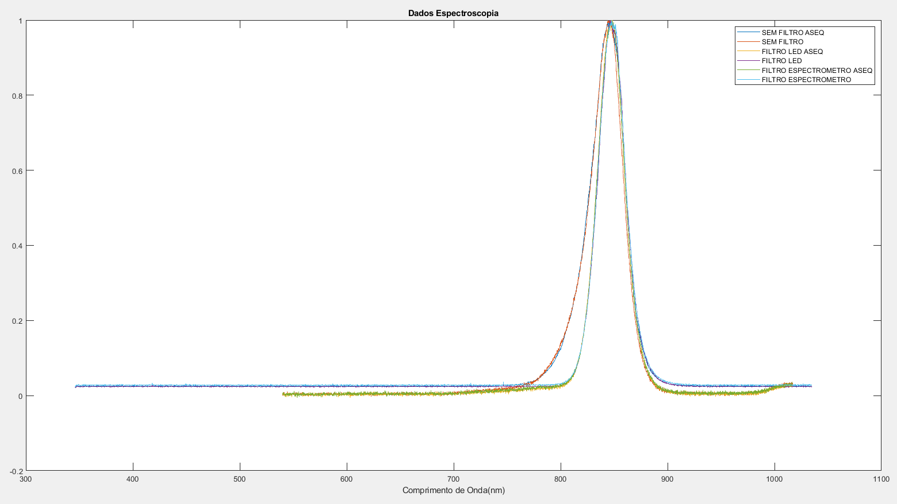

## Spectrometer

- Use of two spectrometers (ASEQ - OCEAN)

- Frequency sweep experiments the grafics corresponds to this situations:

    - Without filter

    - With 850nm filter - close to the source

    - With 850nm filter - close to the sensor

- It is noticeable that the LED operating range is narrow even when used without a filter. - With the filter, the range becomes even narrower (It can be approximated by a pulse!)